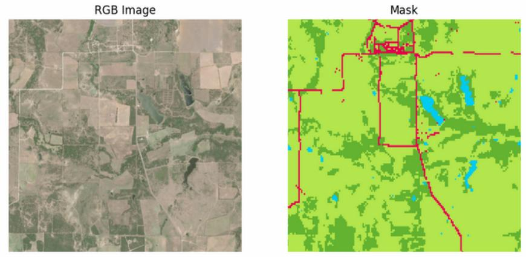
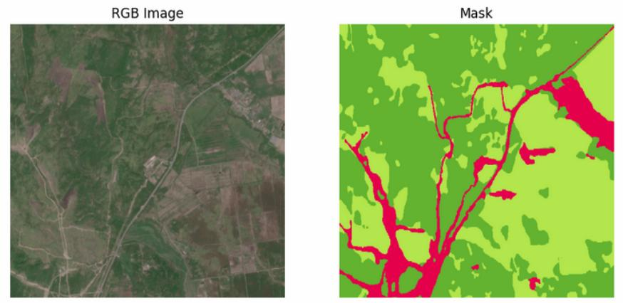
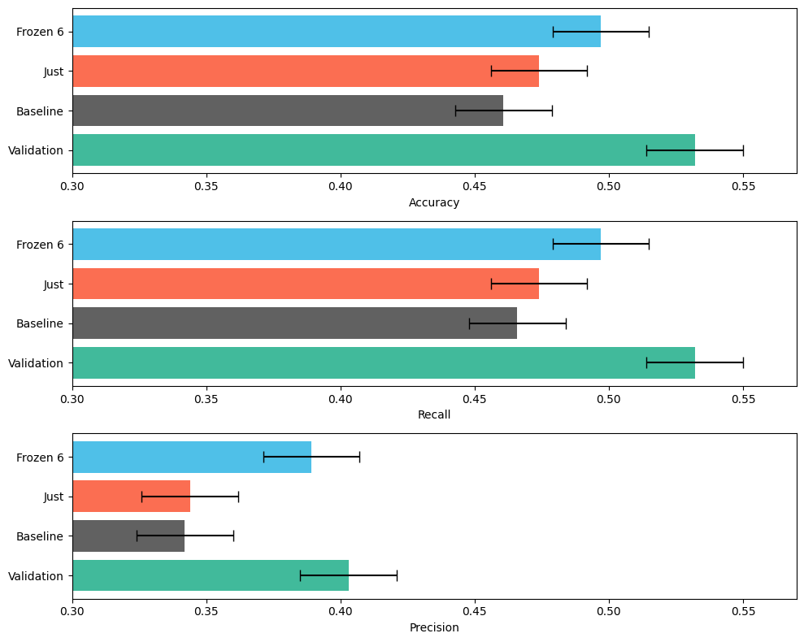

<div style="text-align: center;">
  
</div>

# DASS: Domain Adaptation for Satellite Shots
Team project at [Skoltech summer ML school](https://smiles.skoltech.ru/)


## Dataset structure
Unfortunately, we were asked not to share used dataset, but here are some internals
```python
./datasets # 66G total
├── Russia
│   ├── test # 2.7G
│   │   ├── images # 630 files
│   │   └── masks  # 630 files
│   ├── train # 43G
│   │   ├── images # 8636 files
│   │   └── masks  # 8636 files
│   └── valid # 5.5G
│       ├── images # 1199 files
│       └── masks  # 1199 files
└── USA
    ├── train # 14G
    │   ├── images # 2605 files
    │   └── masks  # 2605 files
    └── valid # 1.8G
        ├── images # 346 files
        └── masks  # 346 files
```

## [Satellite]((https://en.wikipedia.org/wiki/Sentinel-2A)) sensors
|**N**          |0  |1  |2  |3  |4  |5  |6  |7  |8  |9  |
|---------------|---|---|---|---|---|---|---|---|---|---|
|**Sentinel-2A**|B02|B03|B04|B05|B06|B07|B08|B8A|B11|B12|
|**Standard**   |B  |G  |R  |RE1|RE2|RE3|N  |N2 |S1 |S2 |

## Segmentation classes:
|**N**        |0         |1          |2        |3     |4        |
|-------------|----------|-----------|---------|------|---------|
|**seg. mask**|Water     |Urban      |Bare soil|Forest|Grassland|

## Used [spectral indicies](https://github.com/awesome-spectral-indices/awesome-spectral-indices):
|short|long                                       |type     |formula                         |
|-----|-------------------------------------------|----------|-------------------------------|
|BI   |Bare Soil Index                            |soil      |`((S1+R)-(N+B))/((S1+R)+(N+B))`|
|BNDVI|Blue Normalized Difference Vegetation Index|vegetation|`(N-B)/(N+B)`                  |
|MGRVI|Modified Green Red Vegetation Index        |vegetation|`(G**2-R**2)/(G**2+R**2)`      |
|NDCI |Normalized Difference Chlorophyll Index    |water     |`(RE1-R)/(RE1+R)`              |
|NLI  |Non-Linear Vegetation Index                |vegetation|`((N**2)-R)/((N**2)+R)`        |

## Files:
### Image specs:
```
Filename: datasets/USA/train/images/large_22_09.tif
Dimensions: 3D
Shape: (512, 512, 10)
Number of bands: 10
Data type: uint16
Bit depth: 16
Unique colors per band: [1762, 1786, 1786, 1788, 1770, 1803, 1777, 1768, 1767, 1748]
```
### Mask specs
```
Filename: datasets/USA/train/masks/large_22_09.tif
Dimensions: 2D
Shape: (512, 512)
Number of bands: 1
Data type: uint8
Bit depth: 8
Unique colors per band: [5]
```
### USA example
<div style="text-align: center;">
  
</div>

### Russia example
<div style="text-align: center;">
  
</div>

## Experiment explanation:
1. Pre train CNN on `USA` dataset, measure performance: __Validation__;
2. Measure performance on `Russia/test`: __Baseline__;
3. Randomly choose 1k shots from `Russia/train`;
4. Train 1 epoch, measure performance: __Just__;
5. Undo changes, freeze layers 0-6;
6. Train 1 epoch, measure performance: __Frozen6__.

## Experiment results (added error bars for artistic purpose)
<div style="text-align: center;">
  
</div>

## Disclaimer
Performed experiment isn't actually a domain adaptation _per se_. But adding calculated Spectral Indicies (SI) as a sort of invariant properties of landcovers is indeed much closer to domain adaptation attempts. Further experiments are needed to compare model performance with and without added SI layers.